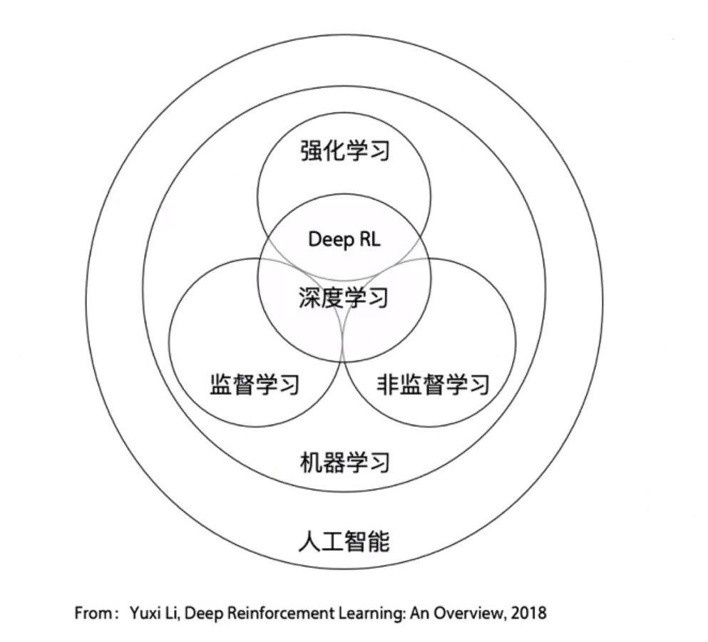
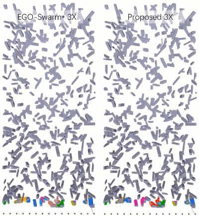

SZTU UGV&UAV exploration in uncertain environment 
===========================================================================
`This is a repository for students and anyother developers who interested in UGV&UAV exploration.`

# 仓库使用说明
本仓库属于深圳技术大学UGV&UAV探索项目，参考了深圳朝闻道科技有限公司的开源库与西北工业大学飞行传感实验室的开源库。所有开发者均可使用，欢迎提出任何建议。
# git
git是一个重要的工具，开发人员应学会使用git进行文件下载与上传，使用教程请参考[git使用教程](https://www.guyuehome.com/14906)。如果要git push，请参考这篇[教程](https://chinese.freecodecamp.org/news/how-to-make-your-first-pull-request-on-github/)
## 入门
机器人包括无人机以及无人车在未知环境探索的主要难点是避障与路径规划，如果从零开始那么要求开发者有极高的科学素养，这对于大部分开发者来说几乎是不可能的。所幸ROS已经将各个开发模块集成起来，这无疑减轻了开发的负担。ROS是Willow Garage公司创建的一个机器人开源项目库，全程Robot Operation System，关于Willow Garage的传奇故事感兴趣的可以参考下面的博[willow garage](https://www.guyuehome.com/7521)。
## 初级教程
对于不熟悉的同学，可以参考古月居的基础教程[ROS入门21讲](https://www.guyuehome.com/34648)，前几讲如Linux操作基础和ROS安装教程由于国内的开发环境问题，在更新源的时候可能会被墙掉，这个问题的解决方法使用梯子。如果能够使用朝闻道配好的克隆盘这部分就可以跳过了。同时也还可以参考深圳朝闻道科技有限公司的开发[Wiki](https://edu2.taobotics.com/wiki/)
## 高级教程
恭喜你现在已经完成了ROS的基础部分学习，要想深入研究，阅读ROS的官方文档是不可逃避的一部分，[ROS官方文档](http://wiki.ros.org/Documentation),虽然刚开始阅读英文文档是比较痛苦的事情，但是坚持下来相信您一定会有收获。Ros官方文档的前面几章与古月居的ros入门21讲相似，可以跳过。
# 深入开发
本小结对应ros的深入开发，主要的内容是UGV&UAV exploration 开发与研究所遇到的经验总结，需要一定的ROS开发基础，也欢迎各位开发者补充。
## 1.astra_ros摄像头使用
astra摄像头是一款成熟的商用摄像头，国内的乐视摄像头便是使用了该摄像头内核。需要注意的是该摄像头不是网络摄像头，不能使用opecv直接调用，需要使用roslaunch调用节点并使用如rviz或rqt进行话题topic的读取，关于话题的读取前面的初级教程已经讲过了，可以进行回顾[ros topic](https://edu2.taobotics.com/wiki/Tutorial/Beginner/1.3-Important-Topics/doc/index.html]。在这里我们将使用astra提供的(标准驱动)[https://github.com/orbbec/ros_astra_camera)，一般乐视的镜头使用的是astrapro.launch,要注意区分。将文件git到本地后按照README.md指示实现驱动的编译与安装。
## 2.real_sense摄像头使用
real_sense是英特尔生产的一款比较成熟的摄像头，在开发的时候也是要使用realsense的官方驱动[realsense](https://github.com/IntelRealSense/realsense-ros)，也是要通过话题的订阅才能读取到对应的图像。
## 3.slam
Slam是一个移动机器人开发的重要工具。slam全名simulation location and map，是一种建模的方法，详情请参考维基百科[slam](https://zh.wikipedia.org/zh-tw/%E5%90%8C%E6%97%B6%E5%AE%9A%E4%BD%8D%E4%B8%8E%E5%9C%B0%E5%9B%BE%E6%9E%84%E5%BB%BA)。slam家族庞大，常见的有[orb_slam](https://webdiis.unizar.es/~raulmur/orbslam/)、[gmapping](https://openslam-org.github.io/gmapping.html)等算法，这些算法要深入了解需要较高数学素养，需要深入了解卡尔曼滤波，拓展卡尔曼滤波等数学知识，这对于本科生还是有一定难度的。所幸ROS已将将大部分SLAM算法集成到ros包内，对于本科生来说只需要知道怎么用就行了，不必纠结于内部的数学原理。[gmapping_ros](http://wiki.ros.org/gmapping],(orb_slam)[http://wiki.ros.org/orb_slam2_ros)。想要进一步了解slam可以参考这篇文章[here](https://www.zhihu.com/question/396119527/answer/1235876702).
## 4.moveit!
moveit!是机器人motion planing集成库，同样的也是已经封装好了，不需要我们多想直接就可以使用。
这里附上moveit！的官方[wiki](https://moveit.ros.org/)以及[issue](https://github.com/ros-planning/moveit/issues)

## 基于强化学习的动态避障
该部分是项目组研究的重点内容，而且已经取得阶段性成就。
### Reinforcement learning 基础
强化学习是机器学习的一重要研究内容，它和有监督学习、无监督学习构成了机器学习的主要内容，三者的关系如下图所示

关于强化学习的基础内容，初学者可以参考一下的文章及视频
1.强化学习入门[李宏毅强化学习](https://www.bilibili.com/video/BV1Cq4y1j7Lr/)
2.[强化学习基础笔记](https://juejin.cn/post/7070019156103397384)
3.相关论文参考（看看就行了）[综述以及相关的文章](https://www.connectedpapers.com/main/066841efe8d79b4998b7af92eb1f5cf3a3f5ebcd/A-Conceptual-Framework-for-Externally%20influenced-Agents%3A-An-Assisted-Reinforcement-Learning-Review/graph)
相信以上内容看完您应该对强化学习有了初步的了解，接下来要讲的是强化学习与ros等的实用知识
1. 使用TensorFlow框架搭建自己的强化学习网络，[入门demo](https://blog.csdn.net/tensorflowforum/article/details/113104864)
[tensorflow wiki](https://www.tensorflow.org/agents/tutorials/0_intro_rl)
2. 实现手动搭建强化学习框架有一定的难度，ROS已经将该框架融入到ros的开源库中，详细内容可以参考一下的[openai_ros](http://wiki.ros.org/openai_ros#How_to_use_OpenAI_Reinforcement_Learning_infrastructure_to_train_ROS_based_robots_in_Gazebo_simulations)
## 其他未知环境下机器人探索问题
路径规划和路径探索是本小结的主要内容，在该领域，浙江大学的FAST——Lab已经取得的瞩目的成就
[ZJU_fast_lab](https://www.bilibili.com/video/BV1eq4y1F7EJ/),该团队设计的无人机算法已经能够实现探索与规划相结合。
[实验室官网](http://zju-fast.com/)

这里附上浙大的几个开源代码
[无人机仿真](https://github.com/ZJU-FAST-Lab/ego-planner)

# Research 
Includes the advance research of UGV&UAV motion planing and any other relative works. Please browse [here](https://github.com/ahasfasd/Shenzhen-technology-university-exploration-in-uncertain-environment/tree/main/research)

### 其他小问题
### 关于翻墙
翻墙是国内ROS学习以及开发所要面临的一个重大难题，关于翻墙的历史以及相对应的内容可以点击[这里](./other/defence%20wall.md)

    
