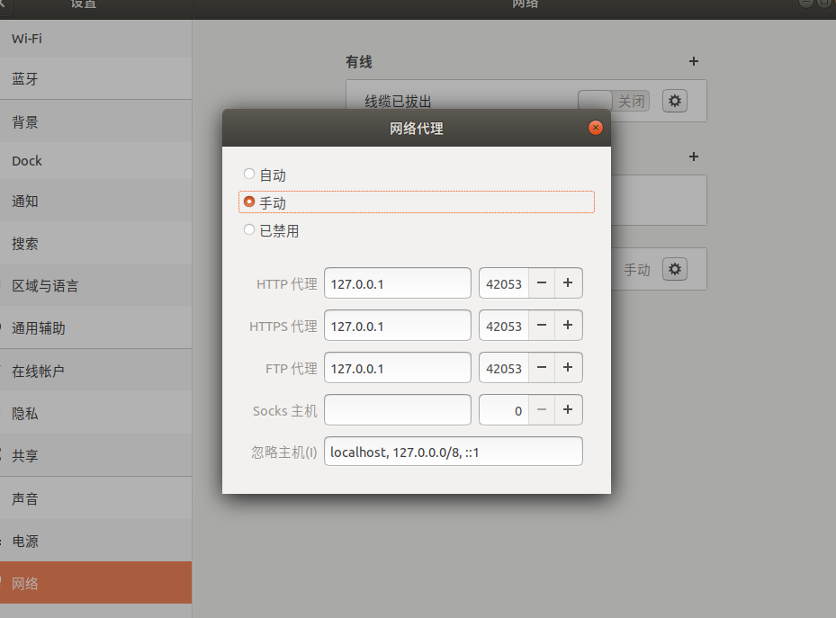

## 翻墙历史
对于国内开发者来说，墙无疑是一个比较大的阻碍。该墙全名防火长城，是在98年创建的，原本的目的是保护国家的部分机密。在08年由于在奥运会前夕恐怖分子在facebook上策划对部分地区的袭击，中国政府不得不将防火墙的范围拓宽到民用的范围。所以08年以后google、gmail等已经被墙掉了。虽然也给大部分开发者造成了一定的困难，但是国家这样也是为了国家安全。

## 解决方法
解决方法也简单，一般的翻墙方法有http代理，shadowsocks，网关代理等，但是能够实现硬件层面上的翻墙只有shadowsocks，网关代理，基于openwrt的软路由。

我使用的500ml矿泉水瓶这个翻墙软件，该软件是基于clash内核，类似shadowcocks，每个月只需15元，有需要的可以bing搜索`500ml矿泉水瓶`进行订阅。然后安装上面的指示进行操作。对于Linux用户，使用clash并不如windows那么简单，我推荐使用[clash for windows linux移植版本](https://github.com/Fndroid/clash_for_windows_pkg/releases/download/0.20.3/Clash.for.Windows-0.20.3-x64-linux.tar.gz),下载解压后运行cfw，并在500ml矿泉水瓶window使用教程下手动下载复制URL地址，再在clash软件的profile粘贴地址并下载。然后在general点击Minni。最后打开主机的网络设置，将http代理、https代理、ftp代理全部改成127.0.0.1，端口号一般为7890，也可以在clash软件的General下看到对应的端口号。以上步骤完成后便可以科学上网了。
## 记得打开代理后手动调节网络代理
