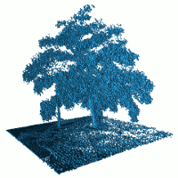

# Reseach 
This part is the advance research of UGV&UAV exploration in uncertain environment, robot arm motion planing and reinforcement leanring.Feel free to discuss in [issue](https://github.com/ahasfasd/shenzhen-technology-university-of-uncertain-terrain-exploration-/issues). In additon, if you have any good idea, it will be admired if share with us.
The structure of this part is shown below, please obey the rule if you want to pull your own research.


```
./research
  |__README.md
  |__research1(xxxxxx)
      |__README.md
      |__research_paper.pdf(if supplyed)
      |__code
  |__research2(xxxxxx)
      |__README.md
      |__research_paper.pdf
      |__code

```
Repository tree :
1. OctoMap is an efficient library for 3D occupacy grid mapping apporch, providing data structures and mapping algorithms in C++ particularly suited for robotics. You can browse [here](http://octomap.github.io/) for more imformation and the repository is deposit [here](./octomap) including code and relative [paper](./octomap/OctoMap:%0AAn%20Efficient%20Probabilistic%203D%20Mapping%20Framework%20Based%20on%20Octrees.pdf).



2. FCL is a general purpose library for collision and proximity queries. The relative [FCL_paper](http://gamma.cs.unc.edu/FCL/fcl.pdf) and [research](https://www.youtube.com/watch?v=wxkvW8CtHt0&feature=emb_rel_end). By now, Uiiversity of North Carolina has made a great effort in collision detection. For more information please browse [here](http://gamma.cs.unc.edu/research/collision/packages.html).
Also, ROS has integrated FCL into its own [package](./fcl)
